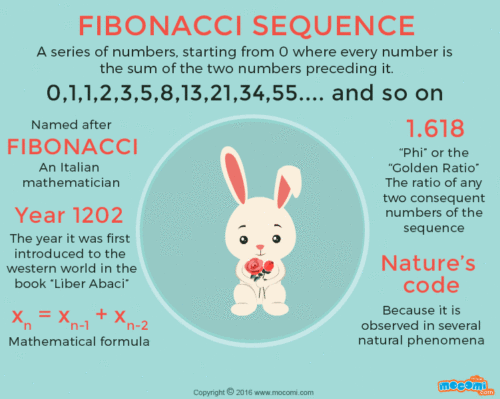
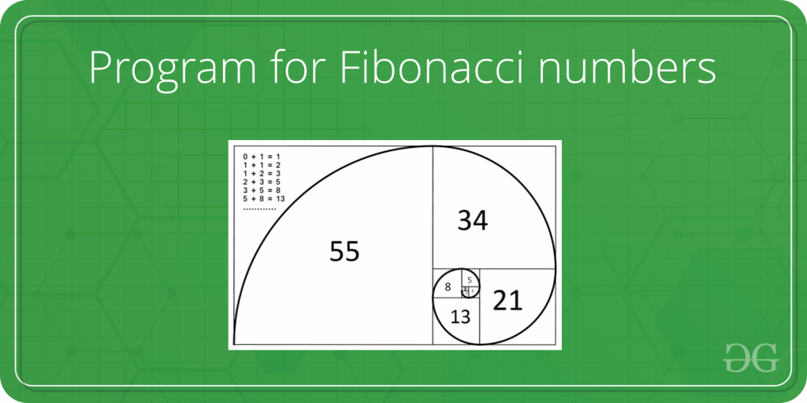
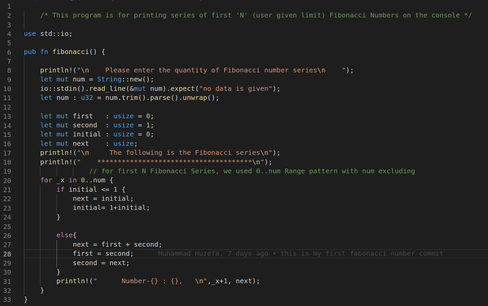

# **1. Fibonacci Sequence:** 

### The Fibonacci Sequence is the series of numbers: 
## *0, 1, 1, 2, 3, 5, 8, 13, 21, 34, ...* 
## The    next number  is found by adding up the two numbers before it.
## like 
## **0 + 1** = ***1*** , 
## **1 + ***1***** = ***2*** 
## ___and so on...___
[Want to learn more on fibonacci sequence](https://en.wikipedia.org/wiki/Fibonacci_number
"Wikipedia link to Fibonacci Series")
 ---
 <!-- ___ for hr  -->
# **2. Imgaes:**
## below picture is the short story of ***Fibonacci Sequence***
 
# **3. Graphical Interpretation:**
 
 

## *The above two images are pictorial Interpretations of Fibonacci Series*
# **4. Source Snapshot:**
###  

# **5. Code Block:**
```Rust
    
        
    /* This program is for printing series of first 'N' (user given limit) Fibonacci Numbers on the console */

use std::io;

pub fn fibonacci() {

    println!("\n    Please enter the quantity of Fibonacci number series\n    ");
    let mut num = String::new();
    io::stdin().read_line(&mut num).expect("no data is given");
    let num : u32 = num.trim().parse().unwrap();
    
    let mut first   : usize = 0;
    let mut second  : usize = 1;
    let mut initial : usize = 0;
    let mut next    : usize; 
    println!("\n     The following is the Fibonacci series\n");
    println!("    **************************************\n");
                // for first N Fibonacci Series, we used 0..num Range pattern with num excluding
    for _x in 0..num {            
        if initial <= 1 {
            next = initial;
            initial= 1+initial;
        }

        else{
            next = first + second;
            first = second;
            second = next;
        }      
        println!("      Number-{} : {},   \n",_x+1, next); 
    }
}

```

#### *"There are two ways to write error-free programs; only the third one works."*
####                          
**~AlanPerils**