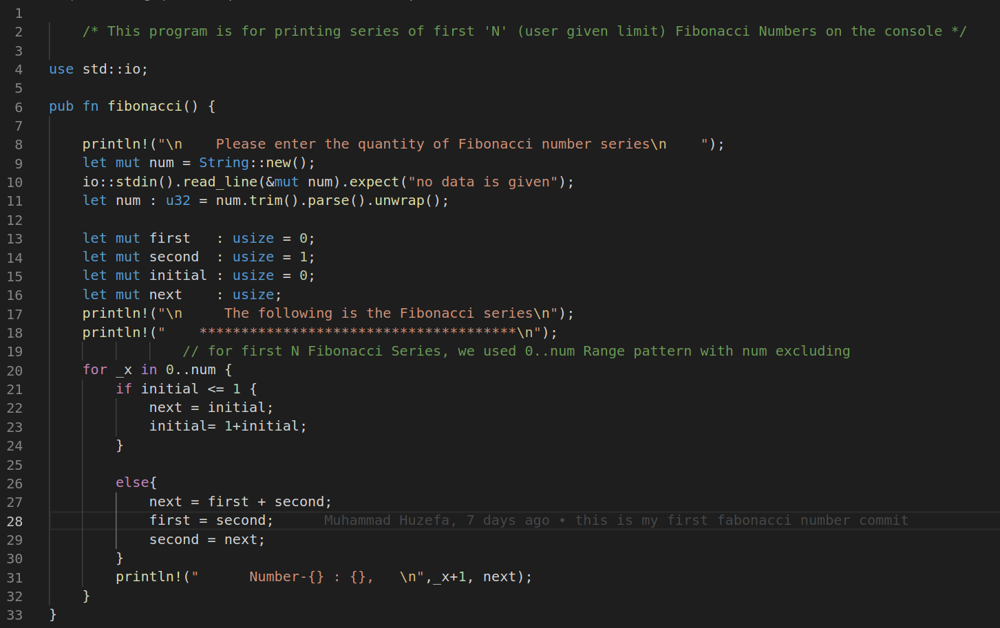

# **1. Fibonacci Sequence:** 

### The Fibonacci Sequence is the series of numbers: 
## *0, 1, 1, 2, 3, 5, 8, 13, 21, 34, ...* 
## The    next number  is found by adding up the two numbers before it.
## like 
## **0 + 1** = ***1*** , 
## **1 + ***1***** = ***2*** 
## *and so on...*
# **2. Imgaes:**
## below picture is the short story of ***Fibonacci Sequence***
 
# **3. Graphical Interpretation:**
 
 

## *The above two images are pictorial Interpretations of Fibonacci Series*
# **4. Source Snapshot:**
###  

## *"There are two ways to write error-free programs; only the third one works."*
##                                **-AlanPerils**